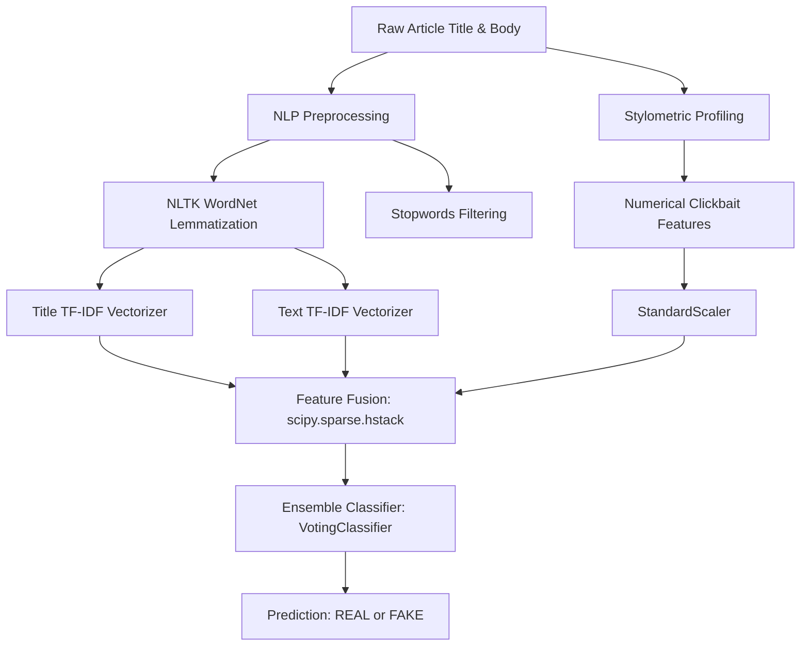

# 📰 Fake vs. Real News Detection System

An institutional-grade, end-to-end machine learning pipeline built to classify news articles as **REAL** or **FAKE** with extremely high precision. By fusing classical TF-IDF content representations with advanced stylometric clickbait analysis and ensembled machine learning models, this system achieves superior accuracy and high generalization capability.

---

## 🚀 Key Features

* **Dual-Path Feature Fusion**: Vectorizes the article's *Title* and *Body Text* separately via independent TF-IDF vectorizers. This prevents high-intensity title keywords from being diluted by long-form body text.
* **Stylometric & Clickbait Profiling**: Extracts metadata features from articles to capture structural anomalies commonly associated with sensationalist or fake news:
  * **Exclamation & Question Frequency**: Counts of `!` and `?` in the title and text body.
  * **Capitalization Ratio**: Measures the proportion of fully uppercase words in titles (a strong tell for clickbait e.g., *"SHOCKING"*, *"BREAKING"*).
  * **Length Discrepancy**: Compares absolute title length and text length ratios.
* **NLTK Lemmatization**: Preprocesses raw text with NLTK `WordNetLemmatizer` to normalize word tokens to their root forms, greatly reducing sparsity in vocabulary vectors.
* **Ensemble Classifier**: Stacks **Logistic Regression** and a **Passive-Aggressive Classifier** (which is highly optimized for text classification and error correction) into a unified `VotingClassifier` consensus.
* **Robust Zero-Setup Data Ingestion**: Operates entirely on relative paths (`./data/`). Includes an automated fallback that generates high-quality mock data so the pipeline runs flawlessly out of the box on any environment.

---

## 🛠️ System Architecture



---

## 📋 Installation & Requirements

Ensure you have Python 3.8+ installed along with the required scientific computing libraries:

```bash
pip install numpy pandas scikit-learn nltk scipy
```

---

## 💻 How to Run

1. **Clone the Repository**:
   ```bash
   git clone https://github.com/ankushsingh003/fake-news-detection-system.git
   cd fake-news-detection-system
   ```
2. **Execute the Notebook**:
   Open and run all cells in `main.ipynb` using Jupyter Notebook, VS Code, or JupyterLab.
   * The pipeline will automatically create the `./data/` directory and populate it with a sample dataset if no files are present.
   * If you have the full Kaggle dataset, place `Fake.csv` and `True.csv` directly inside the `./data/` folder.

3. **Inference Function**:
   Call the built-in `predict_news` function directly:
   ```python
   predict_news(
       title="BREAKING: Shocking alien base found on the moon!",
       text="Rumors are spreading today about hidden structures. Click here to watch shocking video evidence!"
   )
   # Returns: "FALSE NEWS"
   ```

---

## 📊 Evaluation & Metrics

The model is evaluated using stratified splits and provides:
* **Accuracy Score**
* **Precision, Recall, and F1-Scores** for both Fake and Real classes
* **Confusion Matrix**